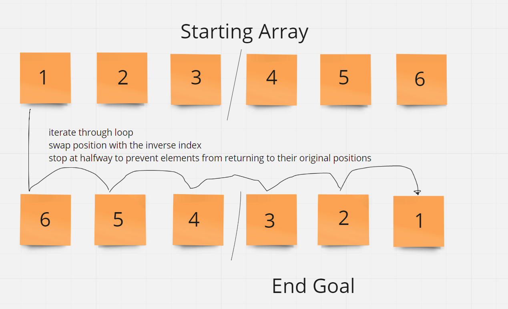

# Reverse Array

Write a function called `reverseArray` which takes an array as an argument. Without utilizing any of the built-in methods available to your language, return an array with elements in reversed order.

## Inputs / Outputs

* Input: `[1, 2, 3, 4, 5, 6]`
* Output: `[6, 5, 4, 3, 2, 1]`

## Algorithm

* Grab the ends of the array --> swap their values
  * Use a for loop to iterate through the array
  * At each time, swap with the interverse index
  * Go half way through the array and stop
    * Stopping at this point will prevent the elements to swap back to their original positions

## Pseudocode

```plaintext

function Reverse-Array takes in `arr`:

  declare start <- 0;
  declare end <- length of arr minus 1;

  while start <= end:
    declare temp <- arr[start]
    arr[start] <- arr[end]
    arr[end] <- temp
    start = start + 1
    end  = end - 1

```

## Code
To come.

## Visual

