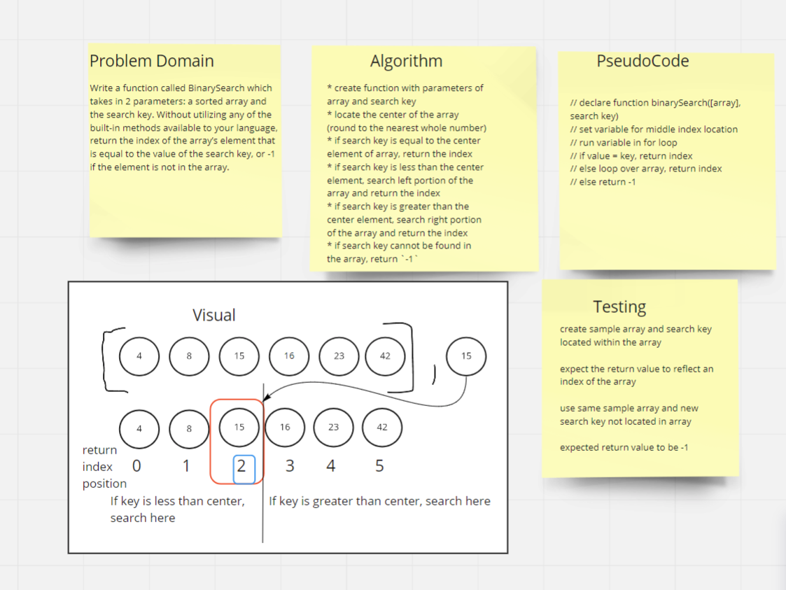

# Array Binary Search
Write a function called BinarySearch which takes in 2 parameters: a sorted array and the search key. Without utilizing any of the built-in methods available to your language, return the index of the array’s element that is equal to the value of the search key, or -1 if the element is not in the array.

## Inputs / Outputs

* Input: `[4, 8, 15, 16, 23, 42], 15` || 15 is the search key
* Output: `2` || the index at which the search key can be found

## Algorithm

* create function with parameters of array and search key
* locate the center of the array (round to the nearest whole number)
* if search key is equal to the center element of array, return the index
* if search key is less than the center element, search left portion of the array and return the index
* if search key is greater than the center element, search right portion of the array and return the index
* if search key cannot be found in the array, return `-1`

## Pseudocode

```plaintext
// declare function binarySearch([array], search key)
// set variable for middle index location
// run variable in for loop
// if value = key, return index
// else loop over array, return index
// else return -1

```

## Code

To come.

## Whiteboard Process


## Approach & Efficiency

* The approach I used was how I thought each step of this algorithm would occur based on the illustration provided in the challenge documentation and the reading material. I might have also played with a piece of folded paper to help visualize what the steps were accomplishing. 
* I feel like this is a fairly efficient solution to the problem, provided the code I experiment with works. 