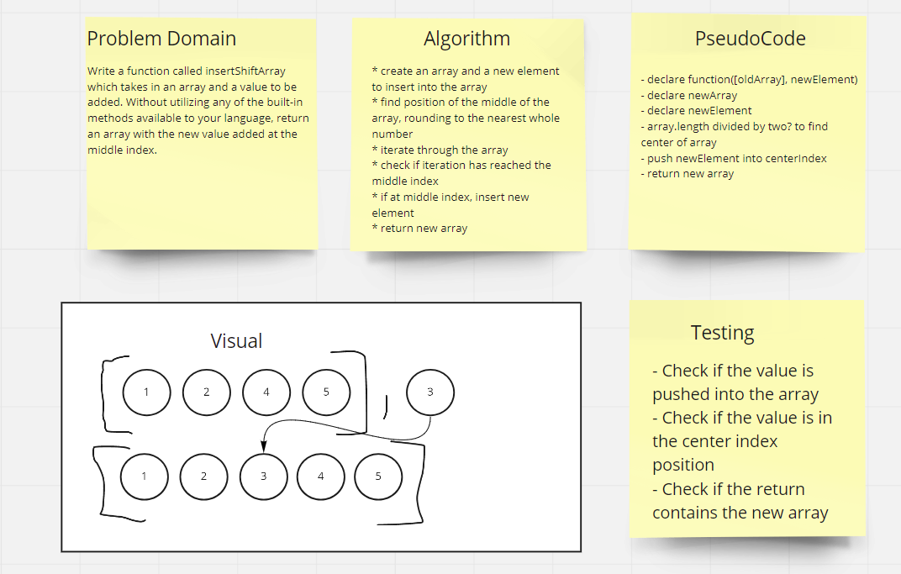

# Insert & Shift an Array
Write a function called insertShiftArray which takes in an array and a value to be added. Without utilizing any of the built-in methods available to your language, return an array with the new value added at the middle index.

## Inputs / Outputs

* Input: `[1, 2, 4, 5], 3` 
* Output: `[1, 2, 3, 4, 5]`

## Algorithm
* create an array and a new element to insert into the array
* find position of the middle of the array, rounding to the nearest whole number
* iterate through the array
* check if iteration has reached the middle index
* if at middle index, insert new element
* return new array

## Pseudocode

```plaintext
// declare function([oldArray], newElement)
// declare newArray
// declare newElement
// array.length divided by two? to find center of array
// push newElement into centerIndex
// return new array

```

## Code
To come.

## Whiteboard Process


## Approach & Efficiency
* The approach I used was how I thought each step of this algorithm would occur, and I thought these steps would be the easiest to implement. I basically talked it out to my cat until it made sense. 
* I'm not entirely sure how efficient this is. I feel like I'm either missing a step or adding in too many. 