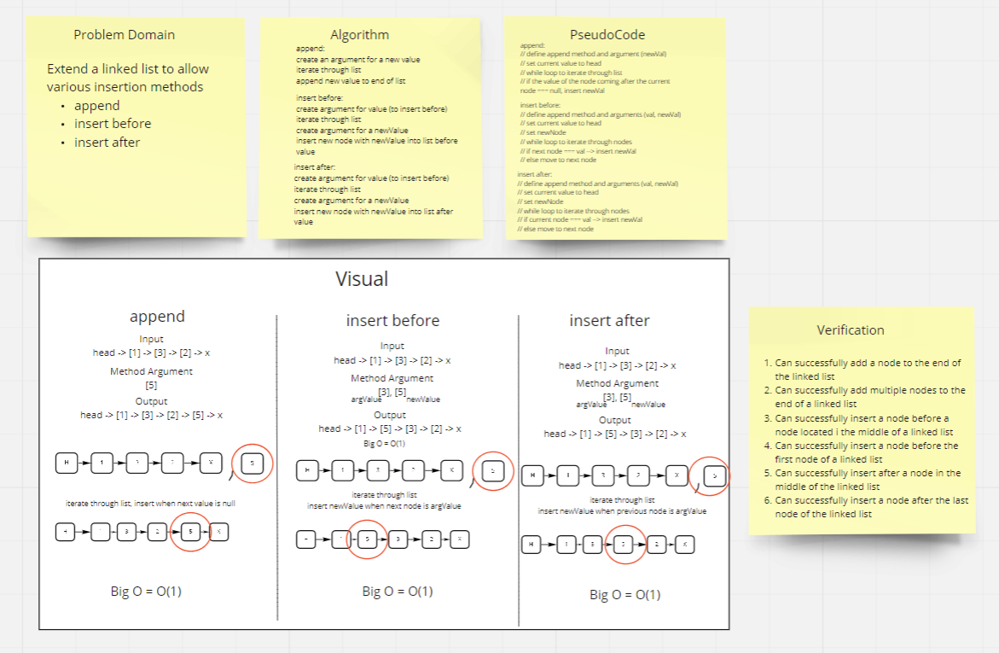
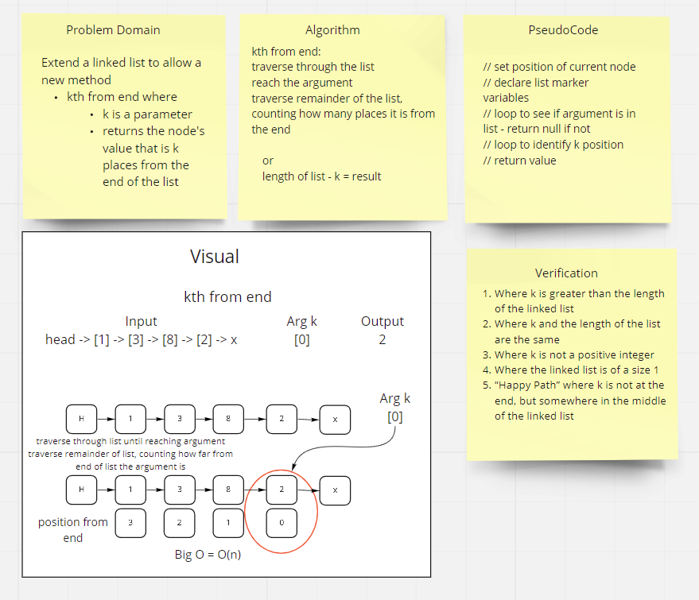
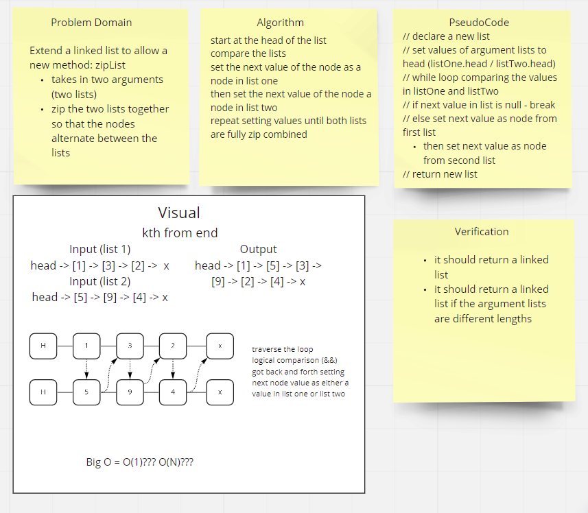

# Challenge Summary

## Challenge 05: Singly Linked List implementation

Create a singly linked list with the following requirements:

1. Can successfully instantiate an empty linked list
2. Can properly insert into the linked list
3. The head property will properly point to the first node in the linked list
4. Can properly insert multiple nodes into the linked list
5. Will return true when finding a value within the linked list that exists
6. Will return false when searching for a value in the linked list that does not exist
7. Can properly return a collection of all the values that exist in the linked list

## Challenge 06: Linked List insertions

Extend the linked list to include the new methods of `append`, `insertBefore`, and `insertAfter` with the following requirements

1. Can successfully add a node to the end of the linked list
2. Can successfully add multiple nodes to the end of a linked list
3. Can successfully insert a node before a node located i the middle of a linked list
4. Can successfully insert a node before the first node of a linked list
5. Can successfully insert after a node in the middle of the linked list
6. Can successfully insert a node after the last node of the linked list

## Challenge 06: Linked List insertion

Extend the linked list to include the new method of `k-thFromEnd`, where the method returns the value of the node that is `k` places from the end of the list.

1. Where k is greater than the length of the linked list
2. Where k and the length of the list are the same
3. Where k is not a positive integer
4. Where the linked list is of a size 1
5. “Happy Path” where k is not at the end, but somewhere in the middle of the linked list

## Challenge 06: Linked List insertion

Extend the linked list to include the new method of `zipList`, where the method combines two linked list like a zipper, one node after another.

1. Where it should return a linked list
2. Where it should return a linked list if the argument lists are different lengths

## Whiteboard Process

### Challenge 06

### Challenge 07

### Challenge 08

## Approach & Efficiency

### Challenge 05

Followed class demo code for initial codebase. Continued building out the code based on the logic presented in the demo. Built testing around the codebase to verify that it works as expected

- `insert()`: O(1)
- `includes()`: O(N)
- `toString()`: O(N)

### Challenge 06

Used code established in challenge 05 to continue building additional methods and testing.

- `append()`: O(1)
- `insertBefore()`: O(1)
- `insertAfter()`: O(1)

### CHALLENGE 07

Used code established in challenges 05 & 06 to continue building and additional method and testing. 

- `kthFromEnd()`: O(N)

### CHALLENGE 08

Thought of three different possible approachs. One was utilizing a series of insertAfters. One was using append multiple times. But I thought using a simple comparison and bringing in values one after another would be the most efficient timewise. 

- `zipList()`: O(1)  (hopefully)

## Solution

[See Code Here](./linked-list/index.js)